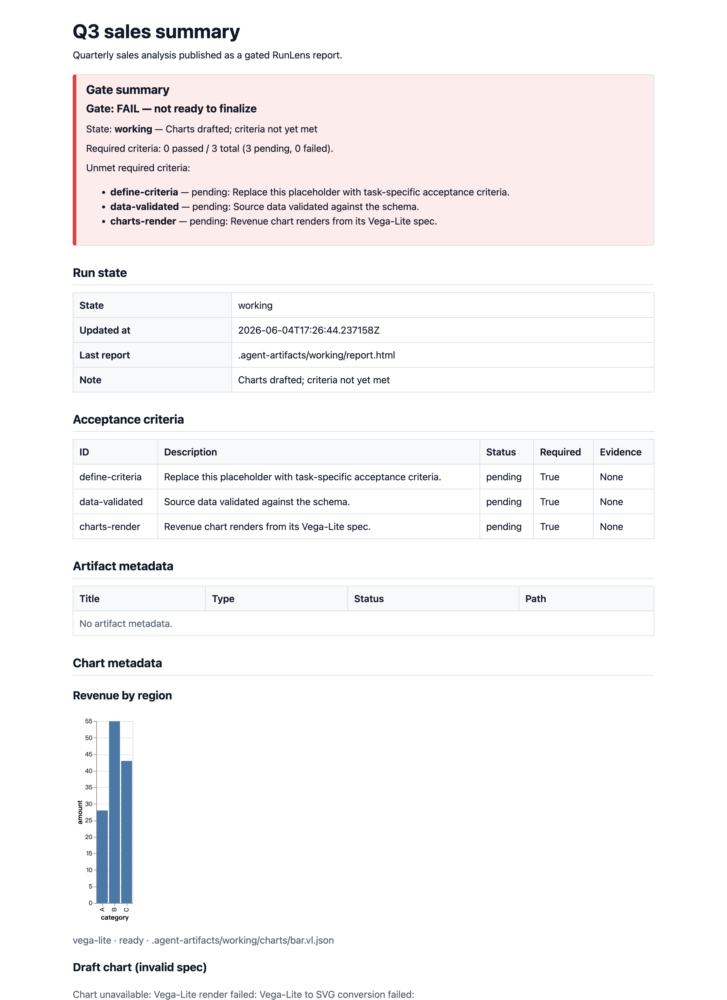
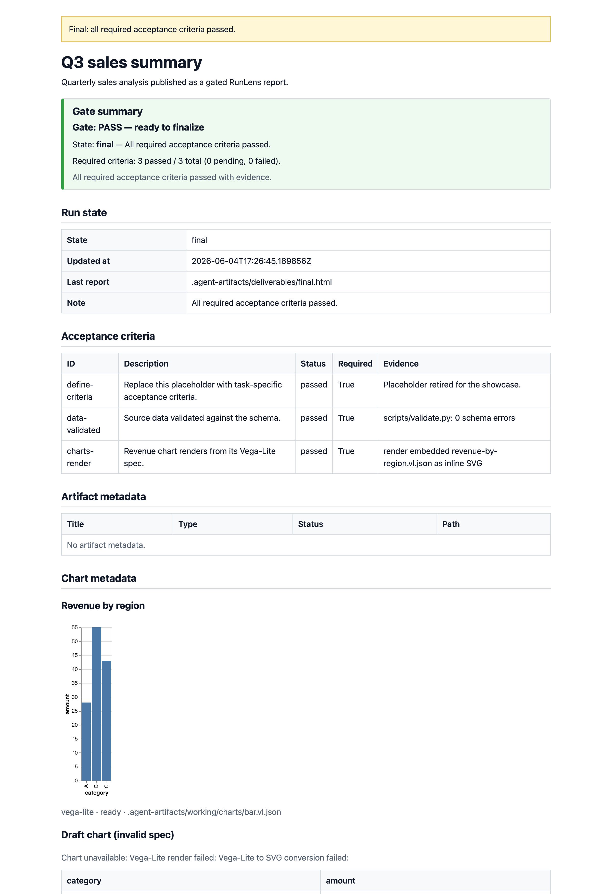

# RunLens

RunLens is a filesystem-first **artifact protocol and CLI** for coding agents. It gives
an agent's progress a place to live on disk — `.agent-artifacts/` — and only lets a run
call itself *done* when machine-checkable acceptance criteria pass with evidence.

It renders plain, static HTML reports you can open with no server and no build step. The
report shows, at a glance, whether the run can finalize and what is blocking it.

| Not ready (`Gate: FAIL`) | Ready (`Gate: PASS`) |
| --- | --- |
|  |  |

Open the same reports locally: [`examples/showcase/working-report-fail.html`](examples/showcase/working-report-fail.html)
and [`examples/showcase/final-report-pass.html`](examples/showcase/final-report-pass.html).

RunLens is deliberately **not** a dashboard, web server, multi-agent orchestrator, or a
chart-inference engine. It manages artifacts and gates final output — nothing more.

## Install

RunLens is a `uv`-managed Python 3.13 project.

```bash
uv sync                 # install dependencies
uv run runlens --help   # run the CLI from the repo
# optional: put `runlens` on your PATH
uv tool install .
```

## Quickstart

The canonical end-to-end workflow is one script:
[`examples/smoke-fixture/run.sh`](examples/smoke-fixture/run.sh) (it is the single source of
truth the adapter docs and tests both point at).

```bash
runlens init                                              # scaffold .agent-artifacts/
runlens criteria add --id parser \
  --description "CSV parser handles quoted fields" --required
runlens criteria pass --id parser \
  --evidence "tests/test_parser.py: 12 passed"
runlens update --state working --note "Implemented parser"
runlens render                                            # refresh working/report.html
runlens finalize                                          # writes deliverables/final.html
```

`init` seeds one **required** placeholder criterion, `define-criteria`, in `pending`. There
is no `criteria remove`, and finalize needs *every* required criterion `passed` with
evidence — so pass it too once your real criteria are in place:

```bash
runlens criteria pass --id define-criteria --evidence "Retired placeholder."
runlens criteria list   # id, status, required, evidence, description
```

## The finalize gate

`finalize` is the only acceptance gate. It writes `deliverables/final.html` **only** when
every `required` acceptance criterion is `passed` and carries non-empty `evidence`.

- Gate not met / spec missing or invalid → state `failed`, any stale `final.html` removed,
  no checkpoint created, non-zero exit.
- `runlens finalize --blocked-reason "Missing prod token"` → state `blocked`, no final
  output. (An empty `--blocked-reason ""` is rejected as CLI misuse.)

The HTML **Gate summary** block is a read-only mirror of this gate — it never decides
anything, it only reports the verdict, the required-criteria counts, and the unmet ones.

## Charts

Charts are [Vega-Lite](https://vega.github.io/vega-lite/) `.vl.json` specs referenced by
path from `charts[]`. The agent drops a spec on disk; RunLens pre-renders it to **inline
SVG** via `vl-convert`. A missing or invalid spec degrades to a data-table / link fallback
instead of crashing the report — see the "Draft chart (invalid spec)" panel in the PASS
screenshot above. RunLens never infers chart types or builds charts from raw data.

Example specs: [`examples/charts/`](examples/charts) (`bar.vl.json`, `line.vl.json`,
`invalid.vl.json`).

## Run states

`run_state.json` holds the current snapshot only. The state machine:

`working` → `checkpoint` (explicit, via `runlens checkpoint --reason …`) / `blocked` /
`failed` / `final`. Only `checkpoint` writes `checkpoints/`; only a passing `finalize`
writes `deliverables/final.html`; `render` is a repeatable presentation step that writes
neither.

## What lives where

```
.agent-artifacts/
├── artifact_spec.yaml      # task contract + acceptance-criteria evidence ledger
├── run_state.json          # current execution snapshot (+ history)
├── RUN_STATE.md            # human-readable mirror of run_state.json
├── working/report.html     # repeatable working report (render)
├── working/charts/*.vl.json
├── checkpoints/*.html      # explicit checkpoints only
└── deliverables/final.html # written only by a passing finalize
```

Acceptance criteria live in `artifact_spec.yaml` and nowhere else — never copy them into
`run_state.json`. The root `.agent-artifacts/` is local runtime state and is git-ignored;
the only committed example trees live under `examples/`.

## Agent adapters

The protocol is the CLI; agent instruction files are thin adapters that steer different
agents to the same workflow:

- [`AGENTS.md`](AGENTS.md) — Codex, Cursor, opencode, Qwen Code, and similar agents.
- [`CLAUDE.md`](CLAUDE.md) — Claude Code adapter (commands + architecture).
- [`examples/adapters/opencode/runlens-artifact-protocol/SKILL.md`](examples/adapters/opencode/runlens-artifact-protocol/SKILL.md)
  — opencode skill adapter.

A test (`tests/test_smoke_adapter.py`) keeps these three documenting the same canonical
commands.

## Development

```bash
uv run pytest -q                          # full test suite
uv run pytest tests/test_finalize.py -q   # one file
git diff --check                          # whitespace lint
```

The repo is TDD-driven: write or update the test first and watch it fail before
implementing. See [`AGENTS.md`](AGENTS.md) for the full protocol rules.
